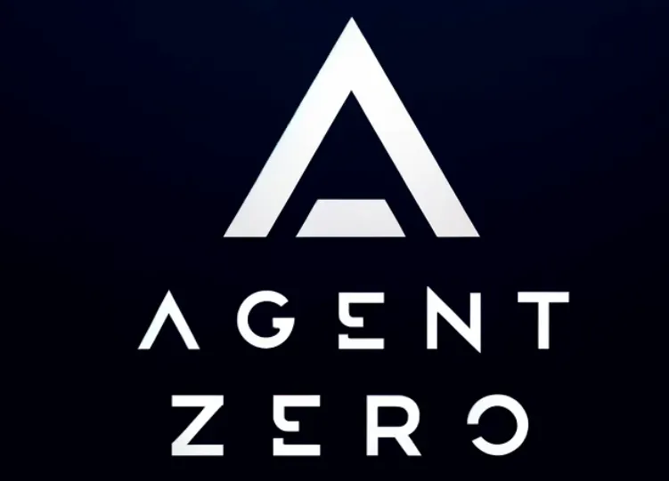

# What is Business Factory?

## Open-source office spaces for zero-human or human-in-the-loop AI Businesses

**Business Factory is an AI Business orchestration platform.**

Business Factory is a Node.js server and React UI that orchestrates a team of AI agents to run a business. It has org charts, budgets, governance, goal alignment, and agent coordination.

> **Note:** Business Factory was previously named Paperclip. All `PAPERCLIP_*` environment variables are still supported for backward compatibility, but new deployments should use `BUSINESS_FACTORY_*` variable names.

|        | Step            | Example                                                            |
| ------ | --------------- | ------------------------------------------------------------------ |
| **01** | Define the goal | _"Build the #1 AI note-taking app to $1M MRR."_                    |
| **02** | Hire the team   | CEO, CTO, Chief of Staff, engineers, designers, marketers — any AI Agent with a Heartbeat. |
| **03** | Approve and run | Review strategy. Set budgets. Hit go. Monitor from the dashboard.  |

<br/>

**COMING SOON: The Business Marketplace** — Download and run entire companies with one click. Browse pre-built business templates — full org structures, agent configs, and skills — and import them into your Business Factory instance in seconds.

<br/>

<div align="center">
<table>
  <tr>
    <td align="center"><strong>Works<br/>with</strong></td>
    <td align="center"><br/><sub>Agent Zero</sub></td>
    <td align="center"><br/><sub>OpenClaw</sub></td>
    <td align="center"><br/><sub>Claude Code</sub></td>
    <td align="center"><br/><sub>Codex</sub></td>
    <td align="center"><br/><sub>Cursor</sub></td>
    <td align="center"><br/><sub>Bash</sub></td>
    <td align="center"><br/><sub>HTTP</sub></td>
  </tr>
</table>

<em>If it can receive a heartbeat, it can be hired.</em>
</div>

<br/>

## Business Factory is right for you if:

- ✅ You want to build **autonomous AI companies or businesses**
- ✅ You **coordinate many different agents** (Agent Zero, OpenClaw, Codex, Claude, Cursor) toward a common goal.
- ✅ You have **20 simultaneous Claude Code terminals** open and lose track of what everyone is doing.
- ✅ You want agents running **autonomously 24/7**, but still want to audit work and chime in when needed.
- ✅ You want to **monitor LLM costs** and enforce budgets.
- ✅ You want a process for managing agents that **feels like using a task manager**
- ✅ You want to manage your autonomous businesses **from your phone**

<br/>

## Features

<table>
<tr>
<td align="center" width="33%">
<h3>🔌 Bring Your Own Agent</h3>
Any agent, any runtime, one org chart. If it can receive a heartbeat, it's hired.
</td>
<td align="center" width="33%">
<h3>🎯 Goal Alignment</h3>
Every task traces back to the company mission. Agents know <em>what</em> to do and <em>why</em>.
</td>
<td align="center" width="33%">
<h3>💓 Heartbeats</h3>
Agents wake on a schedule, check work, and act. Delegation flows up and down the org chart.
</td>
</tr>
<tr>
<td align="center">
<h3>💰 Cost Control</h3>
Monthly budgets per agent. When they hit the limit, they stop. No runaway costs.
</td>
<td align="center">
<h3>🏢 Multi-Company</h3>
One deployment, many companies. Complete data isolation. One control plane for your portfolio.
</td>
<td align="center">
<h3>🎫 Ticket System</h3>
Every conversation traced. Every decision explained. Full tool-call tracing and immutable audit log.
</td>
</tr>
<tr>
<td align="center">
<h3>🛡️ Governance</h3>
You're the board. Approve hires, override strategy, pause or terminate any agent — at any time.
</td>
<td align="center">
<h3>📊 Org Chart</h3>
Hierarchies, roles, reporting lines. Your agents have a boss, a title, and a job description.
</td>
<td align="center">
<h3>📱 Mobile Ready</h3>
Monitor and manage your autonomous businesses from anywhere.
</td>
</tr>
</table>

<br/>

## Problems Business Factory solves

| Without Business Factory                                                                                                                     | With Business Factory                                                                                                                         |
| ------------------------------------------------------------------------------------------------------------------------------------- | -------------------------------------------------------------------------------------------------------------------------------------- |
| ❌ You have 20 Claude Code tabs open and can't track which one does what. On reboot you lose everything.                              | ✅ Tasks are ticket-based, conversations are threaded, sessions persist across reboots.                                                |
| ❌ You manually gather context from several places to remind your bot what you're actually doing.                                     | ✅ Context flows from the task up through the project and company goals — your agent always knows what to do and why.                  |
| ❌ Folders of agent configs are disorganized and you're re-inventing task management, communication, and coordination between agents. | ✅ Business Factory gives you org charts, ticketing, delegation, and governance out of the box — so you run a company, not a pile of scripts. |
| ❌ Runaway loops waste hundreds of dollars of tokens and max your quota before you even know what happened.                           | ✅ Cost tracking surfaces token budgets and throttles agents when they're out. Management prioritizes with budgets.                    |
| ❌ You have recurring jobs (customer support, social, reports) and have to remember to manually kick them off.                        | ✅ Heartbeats handle regular work on a schedule. Management supervises.                                                                |
| ❌ You have an idea, you have to find your repo, fire up Claude Code, keep a tab open, and babysit it.                                | ✅ Add a task in Business Factory. Your coding agent works on it until it's done. Management reviews their work.                              |

<br/>

## Why Business Factory is special

Business Factory handles the hard orchestration details correctly.

|                                   |                                                                                                               |
| --------------------------------- | ------------------------------------------------------------------------------------------------------------- |
| **Atomic execution.**             | Task checkout and budget enforcement are atomic, so no double-work and no runaway spend.                      |
| **Persistent agent state.**       | Agents resume the same task context across heartbeats instead of restarting from scratch.                     |
| **Runtime skill injection.**      | Agents can learn Business Factory workflows and project context at runtime, without retraining.                      |
| **Governance with rollback.**     | Approval gates are enforced, config changes are revisioned, and bad changes can be rolled back safely.        |
| **Goal-aware execution.**         | Tasks carry full goal ancestry so agents consistently see the "why," not just a title.                        |
| **Portable company templates.**   | Export/import orgs, agents, and skills with secret scrubbing and collision handling.                          |
| **True multi-company isolation.** | Every entity is company-scoped, so one deployment can run many companies with separate data and audit trails. |

<br/>

## What Business Factory is not

|                              |                                                                                                                      |
| ---------------------------- | -------------------------------------------------------------------------------------------------------------------- |
| **Not a chatbot.**           | Agents have jobs, not chat windows.                                                                                  |
| **Not an agent framework.**  | We don't tell you how to build agents. We tell you how to run a company made of them.                                |
| **Not a workflow builder.**  | No drag-and-drop pipelines. Business Factory models companies — with org charts, goals, budgets, and governance.            |
| **Not a prompt manager.**    | Agents bring their own prompts, models, and runtimes. Business Factory manages the organization they work in.               |
| **Not a single-agent tool.** | This is for teams. If you have one agent, you probably don't need Business Factory. If you have twenty — you definitely do. |
| **Not a code review tool.**  | Business Factory orchestrates work, not pull requests. Bring your own review process.                                       |

<br/>

## Quickstart

Open source. Self-hosted. No Business Factory account required.

```bash
git clone https://github.com/AijooseFactory/business-factory.git
cd business-factory
pnpm install
pnpm dev
```

This starts the API server at `http://localhost:3100`. An embedded PostgreSQL database is created automatically — no setup required.

> **Requirements:** Node.js 20+, pnpm 9.15+

<br/>

## FAQ

**What does a typical setup look like?**
Locally, a single Node.js process manages an embedded Postgres and local file storage. For production, point it at your own Postgres and deploy however you like. Configure projects, agents, and goals — the agents take care of the rest.

If you're a solo-entrepreneur you can use Tailscale to access Business Factory on the go. Then later you can deploy to e.g. Vercel when you need it.

**Can I run multiple companies?**
Yes. A single deployment can run an unlimited number of companies with complete data isolation.

**How is Business Factory different from agents like OpenClaw or Claude Code?**
Business Factory _uses_ those agents. It orchestrates them into a company — with org charts, budgets, goals, governance, and accountability.

**Why should I use Business Factory instead of just pointing my OpenClaw to Asana or Trello?**
Agent orchestration has subtleties in how you coordinate who has work checked out, how to maintain sessions, monitoring costs, establishing governance - Business Factory does this for you.

(Bring-your-own-ticket-system is on the Roadmap)

**Do agents run continuously?**
By default, agents run on scheduled heartbeats and event-based triggers (task assignment, @-mentions). You can also hook in continuous agents like OpenClaw. You bring your agent and Business Factory coordinates.

<br/>

## Development

```bash
pnpm dev              # Full dev (API + UI, watch mode)
pnpm dev:once         # Full dev without file watching
pnpm dev:server       # Server only
pnpm build            # Build all
pnpm typecheck        # Type checking
pnpm test:run         # Run tests
pnpm db:generate      # Generate DB migration
pnpm db:migrate       # Apply migrations
```

See [doc/DEVELOPING.md](doc/DEVELOPING.md) for the full development guide.

<br/>

## Roadmap

- ⚪ Get OpenClaw onboarding easier
- ⚪ Get cloud agents working e.g. Cursor / e2b agents
- ⚪ Business Marketplace - buy and sell entire agent companies
- ⚪ Easy agent configurations / easier to understand
- ⚪ Better support for harness engineering
- ⚪ Plugin system (e.g. if you want to add a knowledgebase, custom tracing, queues, etc)
- ⚪ Better docs

<br/>

## Contributing

We welcome contributions. See the [contributing guide](CONTRIBUTING.md) for details.

<!-- TODO: add CONTRIBUTING.md -->

<br/>

## License

MIT
